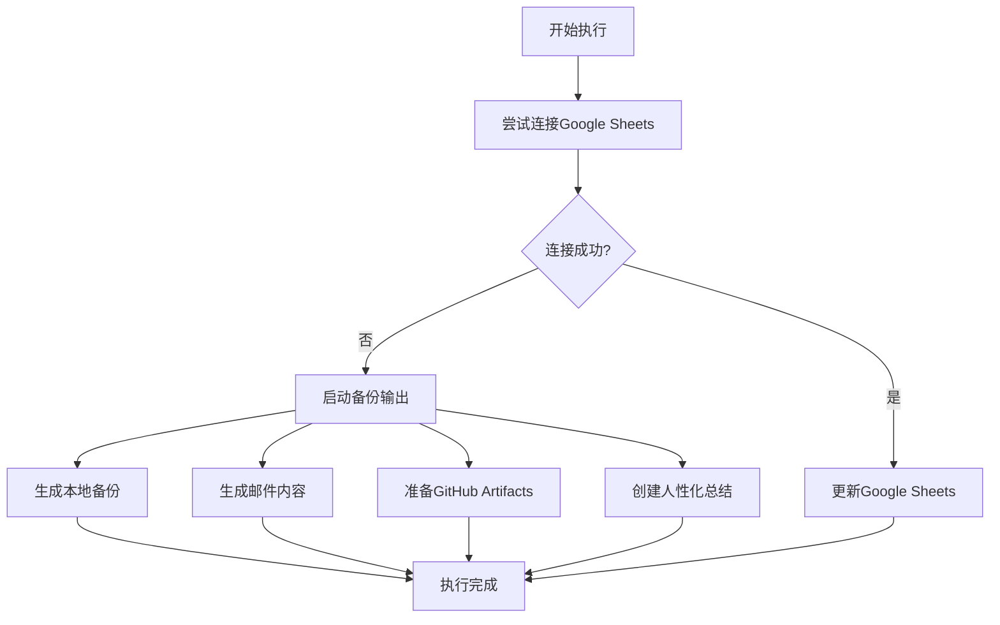

# 📄 备份输出方案指南

## 🎯 问题解决

当Google Sheets连接失败时，系统现在提供多种备份输出方式，确保你的AI词汇挖掘结果不会丢失！

## 🔧 可用的输出方式

### 1. 📁 本地文件备份

**自动生成的文件：**
- `ai_words_backup_YYYYMMDD_HHMMSS.json` - 完整的结构化数据
- `ai_words_summary_YYYYMMDD_HHMMSS.txt` - 人性化的可读总结
- `ai_words_export.csv` - 标准的CSV导出文件

**包含的内容：**
- 完整的词汇数据（定义、类别、重要性等）
- 执行统计信息
- 系统配置信息
- 错误和警告信息

### 2. 📧 邮件通知

**默认收件人：** risunsemi@gmail.com

**邮件内容包括：**
- 📊 执行统计
- 📝 提取的热门词汇（前10个）
- 📄 完整数据作为附件
- 🔧 系统信息和备份方法

**配置邮件发送：**
```bash
# 设置环境变量
export EMAIL_PASSWORD=your_gmail_app_password
export NOTIFICATION_EMAIL=your_email@gmail.com
```

> 注意：需要Gmail应用密码，不是普通密码

### 3. 🚀 GitHub Actions Artifacts

**自动上传到GitHub：**
- 完整的备份文件
- Markdown格式的执行总结
- CSV导出文件
- 执行日志

**下载方式：**
1. 访问GitHub Actions页面
2. 点击对应的工作流运行
3. 在"Artifacts"部分下载文件

### 4. 📋 人性化总结

**生成的总结文件包含：**
- 📅 执行时间和持续时间
- 📊 详细的统计信息
- 📝 提取的词汇列表（含定义）
- ⚠️ 警告和错误信息
- 🔧 使用的备份方法

## 📊 输出格式对比

| 输出方式 | 格式 | 用途 | 可读性 | 数据完整性 |
|---------|------|------|--------|-----------|
| JSON备份 | 结构化 | 程序处理 | 低 | 完整 |
| TXT总结 | 纯文本 | 人工查看 | 高 | 摘要 |
| CSV导出 | 表格 | 数据分析 | 中 | 词汇数据 |
| 邮件通知 | 文本+附件 | 即时通知 | 高 | 完整 |
| GitHub Artifacts | 多种格式 | 版本控制 | 中 | 完整 |

## 🔍 如何使用

### 本地运行
```bash
# 运行完整系统
python main.py

# 测试备份功能
python test_backup_outputs.py
```

### GitHub Actions运行
1. 推送代码到GitHub
2. 系统自动运行
3. 即使Google Sheets失败，也会生成备份
4. 在Actions页面下载artifacts

## 📧 邮件配置详情

### Gmail配置步骤
1. 启用两步验证
2. 生成应用密码
3. 设置环境变量：
   ```bash
   export EMAIL_PASSWORD=your_16_char_app_password
   ```

### 邮件内容示例
```
🎉 AI Words Mining System - Results Report

⏰ Execution Time: 2025-07-11 21:17:41
🕷️ Tools Analyzed: 8
🧠 Words Extracted: 12
⚙️ Words Processed: 10
📊 Google Sheets: ❌ (Failed - using backup methods)

📝 Top Extracted Words:
1. LangChain (AI Framework)
   Definition: A framework designed for developing applications...

2. Whisper Large (Speech AI)
   Definition: An advanced speech recognition model...

📄 Complete data is attached as JSON file.
```

## 🛠️ 故障排除

### 常见问题

**Q: 为什么没有收到邮件？**
A: 检查以下配置：
- EMAIL_PASSWORD 环境变量是否正确
- Gmail应用密码是否有效
- 收件人邮箱地址是否正确

**Q: 本地文件在哪里？**
A: 在项目根目录下：
- `ai_words_backup_*.json`
- `ai_words_summary_*.txt`
- `ai_words_export.csv`

**Q: GitHub Artifacts在哪里下载？**
A: 
1. 访问 GitHub.com/你的用户名/ai-words-mining
2. 点击 "Actions" 标签
3. 选择最新的工作流运行
4. 在 "Artifacts" 部分下载

### 文件位置
```
项目根目录/
├── ai_words_backup_20250711_211741.json    # 完整数据备份
├── ai_words_summary_20250711_211741.txt    # 人性化总结
├── ai_words_export.csv                     # CSV导出
├── email_backup_20250711_211741.txt        # 邮件内容
└── artifacts/                              # GitHub artifacts
    ├── ai_words_backup_*.json
    └── execution_summary.md
```

## 🎯 推荐使用场景

1. **本地开发测试** → 使用 `python test_backup_outputs.py`
2. **生产环境运行** → 配置邮件通知
3. **CI/CD自动化** → 依赖GitHub Artifacts
4. **数据分析** → 使用CSV导出文件
5. **人工查看** → 使用TXT总结文件

## 🔄 自动化流程



## 📞 联系支持

如果你遇到任何问题：
- 查看生成的日志文件
- 检查 `ai_words_summary_*.txt` 文件中的错误信息
- 确保所有环境变量正确配置
- 邮件联系：risunsemi@gmail.com

---

**现在你永远不会丢失AI词汇挖掘的结果了！** 🎉 